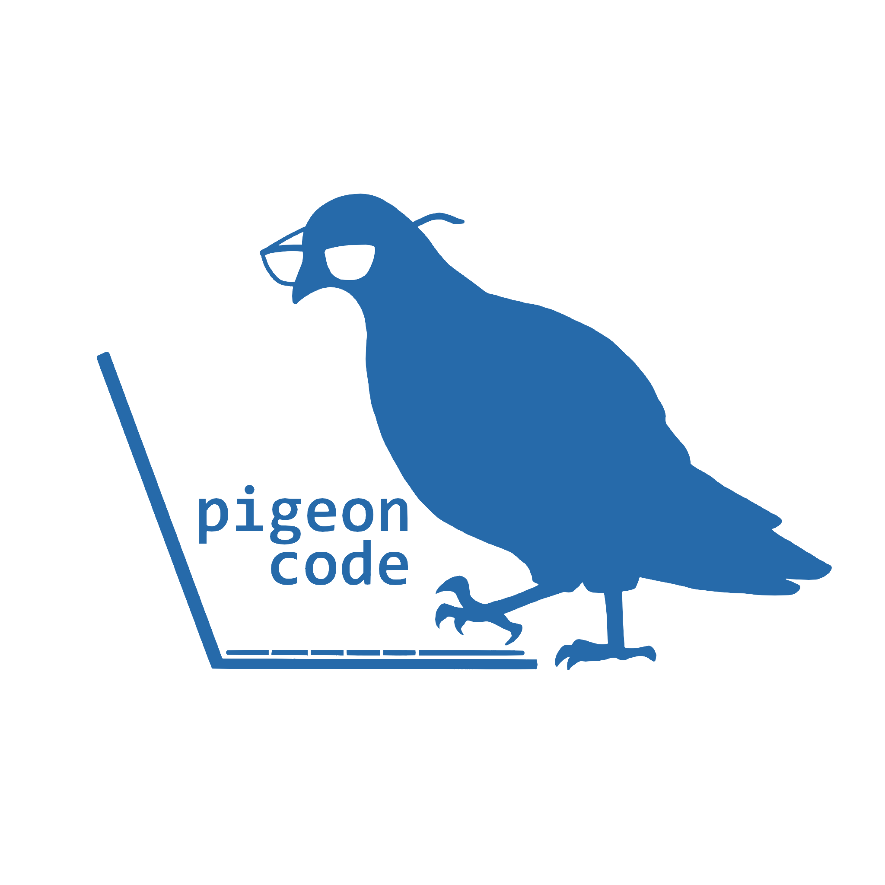

# API 1º Semestre ADS

<p align="center">
      
      <h2 align="center"> Pigeon Code </h2>
</p>

<p align="center">
  | <a href ="#desafio"> Desafio</a>  |
  <a href ="#solucao"> Solução</a>  |   
  <a href ="#backlog-produto"> Backlog do Produto</a>  |
  <a href ="#dor"> DoR</a>  |
  <a href ="#dod"> DoD</a>  |
  <a href ="#sprints"> Cronograma de Sprints</a>  |
  <a href ="#tecnologias">Tecnologias</a> |
  <a href ="#manual">Manual de Instalação</a> |
  <a href ="#colaboradores"> Colaboradores</a> |
</p>
<br>
<br>

## 🎯 Desafio <a id="desafio"></a>

O desafio consiste em criar uma aplicação WEB que descreva a metodologia SCRUM para orientação de times de uma organização e disponibilizar métodos de acompanhamento dos processos pelo gestor responsável

## 🎖️ Solução <a id="solucao"></a>

O PigeonCode vai expor de forma didática o funcionamento da metodologia SCRUM, e permitira que os membros das equipes relatem suas atividades, que serão transpostos para relatórios disponíveis para leitura pelo gestor responsável

<br><br>

## 📋 Backlog do Produto <a id="backlog-produto"></a>

| Rank | Prioridade | User Story                                                                                                                                                                                                                  | Estimativa | Sprint |
| :--: | :--------: | --------------------------------------------------------------------------------------------------------------------------------------------------------------------------------------------------------------------------- | :--------: | :----: |
|  1   |   Média    | Como administrador, desejo visualizar um protótipo navegável do projeto para aprovar o design visual escolhido.                                                                                                             |     8      |   1    |
|  2   |    Alta    | Como administrador, quero que os funcionários em treinamento tenham acesso a explicações sobre a metodologia SCRUM para aplicarem corretamente as práticas no dia a dia.                                                    |     13     |   1    |
|  3   |   Média    | Como administrador, desejo ter uma área restrita ao meu acesso contendo as funcionalidades necessárias para visualizar os resultados obtidos pelas respostas dos formulários.                                               |     20     |   1    |
|  4   |    Alta    | Como administrador, quero que o formulário avaliativo considere os processos envolvidos dentro da metodologia SCRUM, para que ao respondido, possa demonstrar a qualidade da aplicação da metodologia pelas minhas equipes. |     20     |   2    |
|  5   |    Alta    | Como administrador, desejo que os formulários tenham uma estrutura intuitiva de perguntas e repostas para agilizar o processo de preenchimento.                                                                             |     20     |   2    |
|  6   |   Média    | Como administrador, pretendo que os funcionários em treinamento possam vincular cada formulário a uma das seções previamente criadas, garantindo organização e visualização das respostas.                                  |     13     |   2    |
|  7   |    Alta    | Como administrador, pretendo organizar as avaliações em sessões específicas para cada projeto, auxiliando em sua análise.                                                                                                   |     13     |   3    |
|  8   |    Alta    | Como administrador, quero ter acesso a gráficos referentes as respostas dos formulários a fim de compreender rapidamente a qualidade entregue em cada.                                                                      |     20     |   3    |
|  9   |   Média    | Como administrador, desejo visualizar métricas sobre cada processo avaliado pelo formulário para um entendimento mais profundo de quais itens apresentam boa qualidade e quais não.                                         |     13     |   3    |

---

## 📝‍ DoR - Definition of Ready <a id="dor"></a>

- User Stories escritas no formato "Como [persona], quero [ação] para que [objetivo]"
- As US contem critérios de aceitação definidos
- Subtarefas divididas a partir das US
- Priorização atribuída (Alta, Média, Baixa)
- Estimativas atribuídas

## 🏆 DoD - Definition of Done <a id="dod"></a>

- Documentação da API
- Código do projeto concluído
- Vídeos demonstrativos de cada incremento por etapa entregues

---

## 🗓️ Cronograma das Sprints <a id="sprints"></a>

| Sprint   | Período       | Documentação                                       | Histórico                             |
| -------- | ------------- | -------------------------------------------------- | ------------------------------------- |
| SPRINT 1 | 08/09 - 28/09 | [Sprint 1 Docs](./docs/sprints/sprint-1/README.md) | [MVP](./docs/sprints/sprint-1/sp1.md) |
| SPRINT 2 | 06/10 - 26/10 | [Sprint 2 Docs](./docs/sprints/sprint-2/README.md) | [MVP](./docs/sprints/sprint-2/sp2.md) |
| SPRINT 3 | 03/11 - 23/11 | [Sprint 3 Docs](./docs/sprints/sprint-3/README.md) | [MVP](./docs/sprints/sprint-3/sp3.md) |

<br>

## 💻 Tecnologias <a id="tecnologias"></a>

<h4 align="center">
 
 
 <a href="https://flask.palletsprojects.com/en/stable"></a>
 <a href="https://www.atlassian.com/software/jira"></a>
 <a href="https://www.python.org/"></a>
 <a href="https://astah.net"></a>
 <a href="https://github.com/"></a>
 <a href="https://www.figma.com/"></a>
 <a href="https://sqlite.org/"></a>
 <a href="https://getbootstrap.com"></a>
</h4>

## 📖 Manual de Instalação <a id="manual"></a>

### 1. Tenha o GIT instalado na sua máquina!

O GIT é um software de controle de versão muito utilizado pelos desenvolvedores, caso você não tenha este software na sua maquina, siga um dos seguintes tutoriais:
<br>
[Como instalar o Git e configurar o GitHub](https://youtu.be/POpFXae0NP0?si=BXIsrLyj8FkGp9fw)
<br>
[Configurando a Chave SSH entre o Git e o Github](https://youtu.be/5L4Mj5QTLyI?si=M3KtYrVmhL506rFi)
<br>
Git ([Download](https://git-scm.com/downloads))

---

### 2. Tenha uma IDE!

Recomenda-se o uso da IDE Visual Studio Code (VScode) a mesma utilizada no desenvolvimento da aplicação.
<br>
VScode ([Download](https://code.visualstudio.com/download))

---

### 3. Tenha o Python instalado na sua maquina!

Caso você não tenha o interpretador Python instalado em sua maquina, você terá duas opções:

- Baixar pela Microsoft Store, abra o aplicativo e digite na barra de pesquisa "Python" e baixe a versão mais recente disponível
- Baixar pelo site oficial Python.org, acesse o link ([Download](https://www.python.org/downloads/)) e selecione a versão mais recente (aconselhável baixar a versão 3.13, pois é a mais atualizada e estável)

---

### 4. Clone o repositório!

Crie um pasta separa para o projeto e no terminal da sua IDE, digite o seguinte comando:

```bash
git clone https://github.com/PigeonsCode/Equipe-PigeonCode.git
```

---

### 5. Crie um ambiente virtual!

Ambientes virtuais são utilizados para armazenamento de dados com segurança e para organizar as bibliotecas específicas  
do projeto, para criar um ambiente virtual, siga estes passos:

# Opção 1

1- No VScode, na barra de pesquisa superior do VScode, clique na barra e selecione a opção "Show run and commands", ou insira o caractere ">"
<br>
2- Digite"Python: Create Enviorment"
<br>
3- Selecione a opção venv
<br>
4- selecione um intepretador python
<br>
5- selecione o arquivo "requirements.txt" para download, nesta opção, a própria IDE vai baixar as bibliotecas necessárias!
<br>

Pronto, o código vai funcionar perfeitamente!

# Opção 2:

1-No terminal do VScode digite Crtl = ', no seu teclado, o terminal vai abrir
<br>
2-Digite python -m venv (insira o nome da pasta para o ambiente virtual, o padrão é dar o nome de venv)
<br>
3-Abra o terminal (Ctrl+ ou View > Terminal), clique na seta ao lado do ícone "+" para abrir a lista de perfis e selecione "Command Prompt" e digite:

```bash
.\venv\Scripts\activate.bat
```

---

### 6. Instale as bibliotecas!

No terminal digite:

```bash
pip install -r requirements.txt
```

<br>
Este comando vai instalar todas as bibliotecas necessárias para o funcionamento do projeto.

---

### 7. Inicialize o programa!

Va até o arquivo "main.py" e aperte F5, ou inicialize o código a partir da seta que se localiza no canto superior direito.

<br>

## 🎓 Colaboradores <a id="colaboradores"></a>

<div align="center">
  <table>
    <tr>
      <th>Membro</th>
      <th>Função</th>
      <th>Github</th>
      <th>Linkedin</th>
    </tr>
   
   <tr>
      <td>Adler Rocha</td>
      <td>Scrum Master</td>
      <td><a href="https://github.com/AdlerR101"></a></td>
      <td><a href="https://www.linkedin.com/in/adler-rocha-a98480216"></a></td>
    </tr>
    <tr>
      <td>Taís Souza</td>
      <td>Product Owner</td>
      <td><a href="https://github.com/tat4Souza"></a></td>
      <td><a href="https://www.linkedin.com/in/tais-f-souza"></a></td>
    </tr>
    <tr>
      <td>Daniel Nathan</td>
      <td>Desenvolvedor</td>
      <td><a href="https://github.com/Danithan"></a></td>
      <td><a href="https://www.linkedin.com/in/daniel-leite-28220b384/"></a></td>
    </tr>
     <tr>
      <td>Giovana Machado</td>
      <td>Desenvolvedor</td>
      <td><a href="https://github.com/giovana777"></a></td>
      <td><a href="https://www.linkedin.com/in/giovana-machado-49b017384/"></a></td>
    </tr>
     <tr>
      <td>Matheus Borges</td>
      <td>Desenvolvedor</td>
      <td><a href="https://github.com/MGBorgess"></a></td>
      <td><a href="https://www.linkedin.com/in/matheus-de-oliveira-b68bbb383"></a></td>
    </tr>
    <tr>
    <td>Nicolas Pacheco</td>
      <td>Desenvolvedor</td>
      <td><a href="https://github.com/Nocholas0"></a></td>
      <td><a href="https://www.linkedin.com/in/nicolas-santos-pacheco-591216287/?utm_source=share&utm_campaign=sha…"></a></td>
    </tr>
    <tr>
      <td>Vitor Bomfim </td>
      <td>Desenvolvedor</td>
      <td><a href="https://github.com/VitorBomfim-12"></a></td>
      <td><a href="https://www.linkedin.com/in/vitor-bomfim-122339289/"></a></td>
    </tr>
    <tr>
  </table>
</div>
